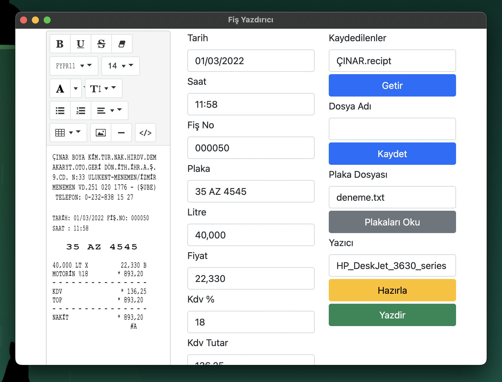
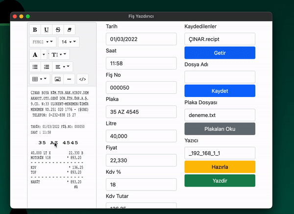
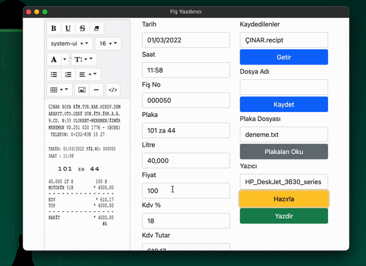
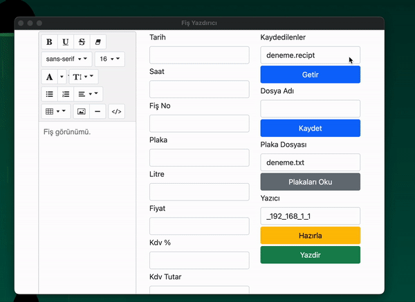
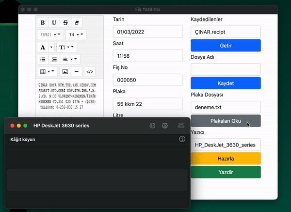

# Akaryakıt İstasyonu Fiş Yazıcı
## Proje Amacı
Akaryakıt istasyonları için fiş yazdırma ve düzenleme işlemlerinin otomatikleştirilmesi.
### Genel Görünüm

## Özellikler
### Canlı Düzenleme

### Bul ve Değiştir

### Kaydet ve Getir

### Otomatik Sıralı Yazdırma
